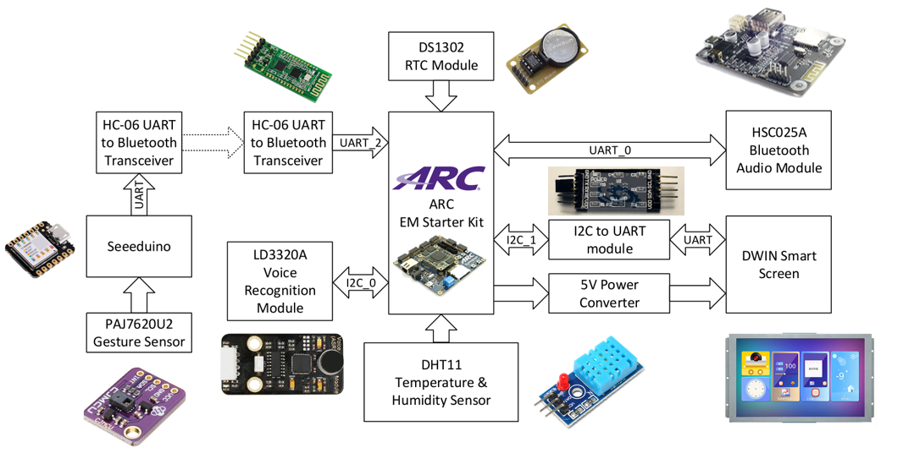
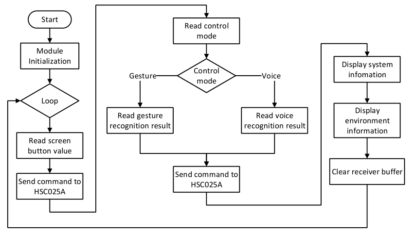
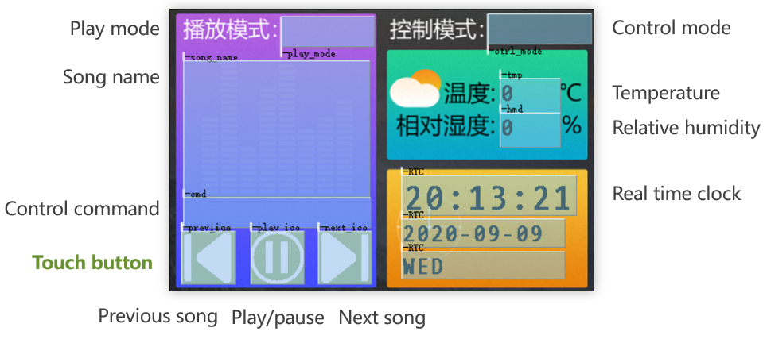

# Smart Bluetooth Speaker
This application is a specific example of using wearable devices to control smart home devices.
This application uses a wearable device to perform remote gesture control of the Bluetooth speaker, and supports voice control and touch screen control at the same time, providing users with more convenience.


- [Smart Bluetooth Speaker](#smart-bluetooth-speaker)
  - [Introduction](#introduction)
    - [Function](#function)
    - [System Architecture](#system-architecture)
      - [Hardware Architecture](#hardware-architecture)
      - [Software Flow](#software-flow)
    - [Smart Screen UI](#smart-screen-ui)
  - [Hardware and Software Setup](#hardware-and-software-setup)
    - [Required Hardware](#required-hardware)
    - [Required Software](#required-software)
    - [Hardware Connection](#hardware-connection)
  - [User Manual](#user-manual)
    - [Before Running This Application](#before-running-this-application)
    - [Run This Application](#run-this-application)
      - [Build Arduino program](#build-arduino-program)
      - [Build EMSK program](#build-emsk-program)


## Introduction
### Function
This smart Bluetooth speaker can accept three control inputs of gesture, voice, and touch screen, and can playing music from Bluetooth master devices or local Micro SD card.
Seeeduino receives and processes gesture signals, and send corresponding data to EMSK through HC-06 Bluetooth transceiver. Voice recognition is implemented by LD3320A module using Auto Speech Recognition algorithm. Touch buttons on smart screen have touch feedback to provide intuitive human-computer interaction.
After receiving control signals, the system sends corresponding instructions to the Bluetooth audio module, and the smart screen displays the current system operating status, as well as environmental temperature and humidity data and real-time clock.
The detailed control commands are as followed:

| Command                | Gesture        | Voice(Chinese Pinyin)      | Touch Screen             |
| ---------------------- | -------------- | -------------------------- | ------------------------ |
| Switch control mode    | forward        | "qie huan kong zhi mo shi" |                          |
| Switch play mode       | up             | "qie huan bo fang mo shi"  |                          |
| Previous song          | left           | "shang yi qu"              | "previous song" button   |
| Next song              | right          | "xia yi qu"                | "next song" button       |
| Play song              | down           | "bo fang"                  | "play/pause song" button |
| Pause song             | down           | "zan ting"                 | "play/pause song" button |
| Volume up              | clockwise      | "jia da yin liang"         |                          |
| Volume down            | anti-clockwise | "jian xiao yin liang"      |                          |
| Enable gesture control | backward       |                            |                          |


### System Architecture
#### Hardware Architecture
  


#### Software Flow
  


### Smart Screen UI
  


## Hardware and Software Setup
### Required Hardware
- 1 DesignWare ARC EM Starter Kit(EMSK)
- 1 Seeeduino, Arduino minimum system board
- 1 HSC025A Bluetooth audio module
- 1 DWIN's DMT48320C035_06W touchable smart screen
- 1 I2C to UART module
- 1 Power converter module for the smart screen
- 1 LD3320A Voice recognition module
- 1 PAJ7620U2 gesture sensor
- 2 HC-06 Bluetooth to UART transceivers
- 1 DS1302 real-time clock module
- 1 DHT11 temperature and relative humidity sensor
- 1 SD Card for EMSK second bootloader
- 2 Micro SD Card, one for HSC025A, one for the initialization of the smart screen


### Required Software
- embARC Open Software Platform(OSP)
- ARC GNU Tool Chain
- Serial Port Utility or other serial port terminal
- Arduino IDE
- [DGUS_V3788](http://www.dwin.com.cn/home/Index/download_file?download_id=1753) for smart screen UI development


### Hardware Connection
1. **EMSK connection**
EMSK implement speaker node, it can be controlled by touch screen input, Voice recognition and remote gesture recognition, and can execute the following command: next/previous song, play/pause, volume up/down, switch control/play mode, etc.. EMSK is powered by a 5V/4A AC power adapter.
The smart screen it connect can display current control status and play status.

| Device             | Bus    | Connector    | Description                                    |
| ------------------ | ------ | ------------ | ---------------------------------------------- |
| HSC025A            | UART_0 | PMOD_1[4:3]  | Bluetooth audio module                         |
| HC-06              | UART_2 | PMOD_5[9:8]  | Bluetooth transceiver for connecting Seeeduino |
| LD3320A            | I2C_0  | PMOD_2[4:3]  | Voice recognition module                       |
| I2C to UART module | I2C_1  | PMOD_4[4:3]  | Convert I2C port to UART to connect the screen |
| DS1302             | GPIO   | PMOD_3[10:8] | Real-time clock module                         |
| DHT11              | GPIO   | PMOD_3[4]    | Temperature and relative humidity sensor       |

1. **Seeeduino connection**
Seeeduino implements wearable controller node, it processes received gesture signals and send the gesture number to EMSK through HC-06 Bluetooth transceiver. Seeeduino is powered by a 5V lithium battery through USB type-C port.

| Device    | Bus  | Connector | Description                               |
| --------- | ---- | --------- | ----------------------------------------- |
| PAJ7620U2 | I2C  | D[5:4]    | Gesture recognition module                |
| HC-06     | UART | D[7:6]    | Bluetooth transceiver for connecting EMSK |


## User Manual
### Before Running This Application
1. Download [Arduino project](https://github.com/Websolder/SmartBluetoothSpeaker/tree/main/Arduino_Project) and [DGUS project](https://github.com/Websolder/SmartBluetoothSpeaker/tree/main/DGUS_Project)

2. Initialize Smart Screen UI
    Copy the whole directory  `/DGUS_Project/DWIN_SET` to an empty Micro SD card, and then insert it to the slot on the smart screen. Power up the screen and complete the initialization, then pull out the Micro SD card and reboot the screen.
    the UI project file `DGUS_Project/DWprj.hmi` can be modified with DGUS_V7388 IDE.


### Run This Application
#### Build Arduino program
Open [Arduino project file](https://github.com/Websolder/SmartBluetoothSpeaker/tree/main/Arduino_Project/HC06-GS.ino) with Arduino IDE, compile the program and download to Seeeduino.


#### Build EMSK program
Before programming EMSK, PMOD mux must be configured in order to use bus drivers of embARC.
```c
// In file "embarc_osp-master/board/emsk/common/emsk_init.c"
	set_pmod_mux(mux_regs, PM1_UR_UART_0 | PM1_LR_SPI_S	\
				| PM2_I2C_HRI			\
				| PM3_GPIO_AC			\
				| PM4_I2C_GPIO_D		\
				| PM5_UR_SPI_M1 | PM5_LR_SPI_M2	\
				| PM6_UR_SPI_M0 | PM6_LR_GPIO_A );
```

Makefile target options about EMSK and toolchain:
```makefile
APPL ?= bluetooth_speaker
BOARD ?= emsk
TOOLCHAIN ?= gnu
OLEVEL ?= 02
BD_VER ?= 22
CUR_CORE ?= arcem7d
```

The middleware used in this application:
```makefile
MID_SEL = common
```

Directories of source files and header files:

```makefile
EMBARC_ROOT = ../../../../..
# application source dirs
APPL_CSRC_DIR = .
APPL_ASMSRC_DIR = .

# application include dirs
APPL_INC_DIR = .

# include current project makefile
COMMON_COMPILE_PREREQUISITES += makefile

### Options above must be added before include options.mk ###
# include key embARC build system makefile
include $(EMBARC_ROOT)/options/options.mk
```

In this application, embARC 2nd bootloader is used to automatically load program binary for EMSK and run. To run this application, execute command `make run` in the terminal, and execute `make bin` to generate binary file for embARC 2nd bootloader. Then, rename the binary file as `boot.bin` and copy it to an empty SD card together with bootloader binary file `bt.bin`. Insert the SD card in the slot on EMSK, power up and this application will start to run.
The initial control mode is voice mode, and the initial play mode is SD mode, and users can control this speaker through method mentioned above.